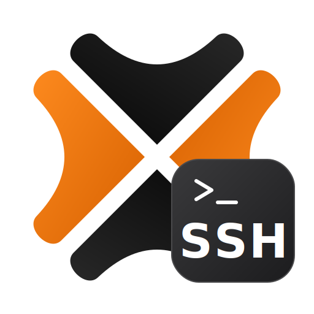

<p align="center">
  
</p>

<h1 align="center">Proxmox VE SSH Script</h1>

<p align="center">
  Run bash scripts on your Proxmox VE node via SSH — each script exposed as a button entity in Home Assistant.
</p>

<p align="center">
  <a href="https://github.com/hacs/integration">
    
  </a>
  <a href="https://github.com/macokay/hacs-proxmox-ve-ssh-script/releases">
    
  </a>
  <a href="https://github.com/macokay/hacs-proxmox-ve-ssh-script/blob/main/LICENSE">
    
  </a>
</p>

<p align="center">
  <a href="https://www.buymeacoffee.com/macokay">
    
  </a>
</p>

---

## Features

- SSH password authentication (PAM users)
- Multiline bash script editor in the UI
- stdout/stderr logged to the Home Assistant log
- Add and remove scripts at any time without reinstalling
- All buttons grouped under a single Proxmox VE device
- Supports multiple Proxmox hosts (add the integration more than once)

---

## Requirements

| Requirement | Version / Details |
|---|---|
| Home Assistant | 2023.1 or newer |
| Proxmox VE | Node reachable from Home Assistant over the network |
| PAM user | User with permission to execute the desired scripts |

---

## Installation

### Automatic — via HACS

1. Open **HACS** in Home Assistant.
2. Go to **Integrations** → three-dot menu (⋮) → **Custom repositories**.
3. Add `https://github.com/macokay/hacs-proxmox-ve-ssh-script` as **Integration**.
4. Search for **Proxmox VE SSH Script** and click **Download**.
5. Restart Home Assistant.

### Manual

1. Download the latest release from [GitHub Releases](https://github.com/macokay/hacs-proxmox-ve-ssh-script/releases).
2. Copy the `custom_components/proxmox_ve_ssh_script` folder to your `config/custom_components/` directory.
3. Restart Home Assistant.

---

## Configuration

1. Go to **Settings → Devices & Services → Add Integration**.
2. Search for **Proxmox VE SSH Script**.
3. Enter the required fields:

| Field | Description |
|---|---|
| Host | IP address or hostname of your Proxmox VE node |
| SSH port | Default: `22` |
| Username | PAM username (e.g. `homeassistant-ssh`) |
| Password | PAM password |

The integration tests the SSH connection before saving. If it fails, check the host, port, and credentials.

Post-setup options are available via **Configure** on the integration card:

| Option | Description | Default |
|---|---|---|
| Add script | Enter a script name and multiline bash content | — |
| Remove script | Select a script from the list to remove | — |

---

## Data

### Entities

| Entity | Type | Description |
|---|---|---|
| `button.{script_name}` | `button` | Press to execute the script on the Proxmox host |

All buttons are grouped under a single Proxmox VE device per host.

### Script output

All output is written to the Home Assistant log:

| Output | Log level |
|---|---|
| stdout | INFO |
| stderr | WARNING |
| Non-zero exit code | ERROR |
| Exit code 0 | INFO |

Enable debug logging:

```yaml
logger:
  default: warning
  logs:
    custom_components.proxmox_ve_ssh_script: debug
```

### Update interval

Button integration — no polling. Scripts execute on demand when the button is pressed.

---

## Recommended Proxmox Setup

Rather than connecting as `root`, use a dedicated least-privilege PAM user that can only execute specific, pre-approved scripts via `sudo`.

### Step 1 — Create a dedicated SSH user

```bash
adduser --disabled-password --gecos "" homeassistant-ssh
passwd homeassistant-ssh
```

### Step 2 — Restrict sudo to specific scripts only

```bash
nano /etc/sudoers.d/homeassistant-ssh
```

```
homeassistant-ssh ALL=(root) NOPASSWD: /usr/local/bin/update-lxc-containers.sh
homeassistant-ssh ALL=(root) NOPASSWD: /usr/local/bin/update-proxmox-host.sh
```

```bash
chmod 440 /etc/sudoers.d/homeassistant-ssh
visudo -c -f /etc/sudoers.d/homeassistant-ssh
```

### Step 3 — Create wrapper scripts

**`/usr/local/bin/update-proxmox-host.sh`**

```bash
#!/bin/bash
apt-get update && apt-get dist-upgrade -y
```

**`/usr/local/bin/update-lxc-containers.sh`**

```bash
#!/bin/bash
bash -c "$(curl -fsSL https://raw.githubusercontent.com/community-scripts/ProxmoxVE/main/tools/pve/update-lxcs-cron.sh)"
```

```bash
chmod +x /usr/local/bin/update-proxmox-host.sh /usr/local/bin/update-lxc-containers.sh
chown root:root /usr/local/bin/update-*.sh
```

### Step 4 — Add the scripts in Home Assistant

| Script name | Script content |
|---|---|
| Update Proxmox Host | `sudo /usr/local/bin/update-proxmox-host.sh` |
| Update LXC Containers | `sudo /usr/local/bin/update-lxc-containers.sh` |

---

## Updating

**Via HACS:** HACS will notify you when an update is available. Click **Update** on the integration card.

**Manual:** Replace the `custom_components/proxmox_ve_ssh_script` folder with the new version and restart Home Assistant.

---

## Known Limitations

- Host key verification is disabled (acceptable for trusted LAN hosts; not recommended over untrusted networks)
- Scripts are stored in HA config entry storage — readable by anyone with HA admin access
- Default SSH timeout is 30 seconds — long-running scripts should be backgrounded (`nohup script.sh &`)

---

## Credits

- [asyncssh](https://asyncssh.readthedocs.io/) — async SSH client library used for non-blocking SSH in Home Assistant

---

## License

&copy; 2026 Mac O Kay. Free to use and modify for personal, non-commercial use. Attribution appreciated if you share or build upon this work. Commercial use is not permitted.
